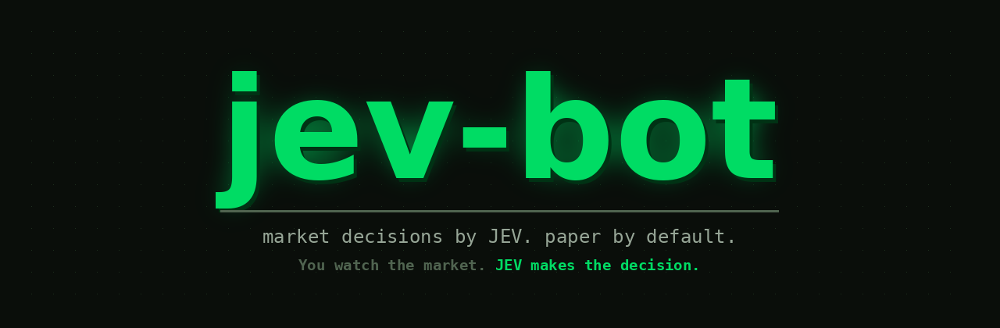
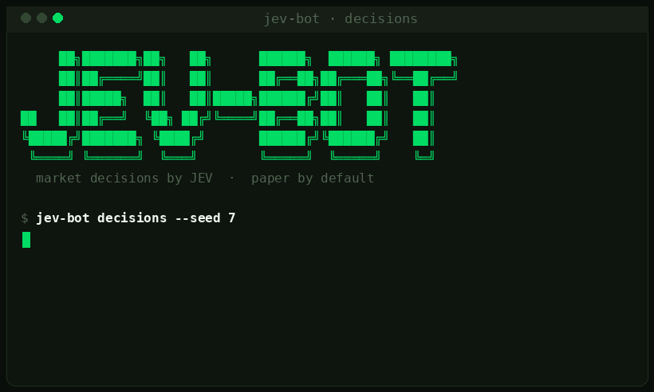
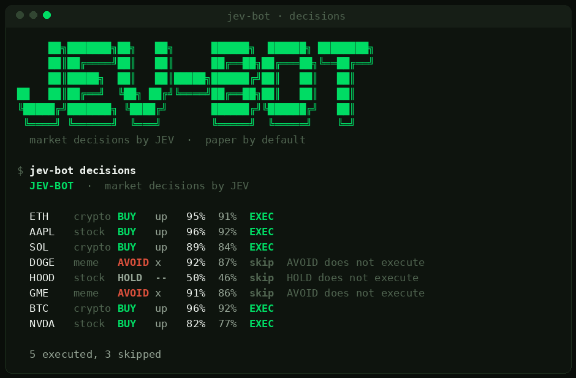
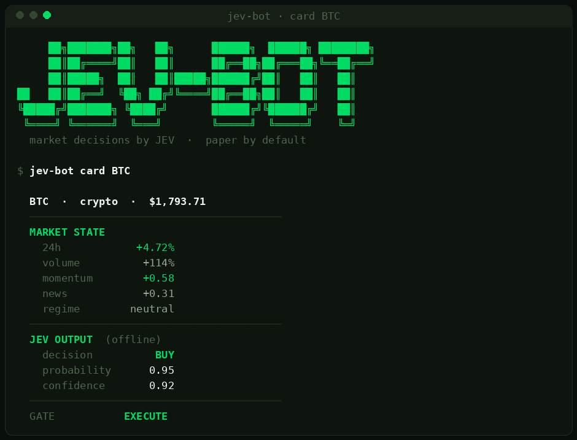
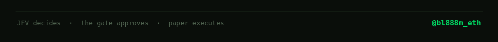

<p align="center">
  
</p>



# jev-bot

`JEV-powered market decision bot for stocks, crypto and memes`


**You watch the market. JEV makes the decision.**

Most AI is built to generate text. [JEV](https://typesafe.ai/blog/introducing-system-one-models-and-jev),
TypeSafe AI's first System One model, is built to decide: you hand it a state
and a typed question with fixed options, and it returns one option with a
calibrated probability in about a tenth of a second, no text to parse. reflex
is a small, open experiment around that idea. It gives JEV a stream of market
states and asks one question, over and over: what is the right action here.

```
market data
     |
    JEV          ->  BUY · SELL · HOLD · AVOID  + a calibrated probability
     |
 risk gate        ->  may this decision execute?
     |
 execution        ->  paper, by default
```



This is not a hedge fund and not a swarm of agent personalities. It is one
decision, made from the state it is given, and a gate that decides whether the
decision is allowed to reach a market at all.

## What is real, what is not

Everything is labelled by its source and mode, and the labels are the point.

| | |
| --- | --- |
| **DATA** | simulated by default, an offline generator across stocks, crypto and memes. Live feeds plug in behind the same shape. |
| **DECISION** | `offline` (a transparent local engine, default) or `jev` (the real TypeSafe model, with a key). Every decision says which one made it. |
| **EXECUTION** | paper. No wallet, no key, no live orders. There is no `--live` flag. |
| **PERFORMANCE** | simulated. Any P&L here is paper over generated data. |

No claim is made that JEV predicts markets or produces guaranteed returns. The
developer, not the model, is responsible for acting on a decision, which is
exactly what the risk gate is for.

---

## Install

Python 3.10 or newer. Nothing to compile, nothing to install for the core.

```bash
git clone https://github.com/bl888m/jev-bot && cd jev-bot
pip install -e .        # optional, to get the `reflex` command on PATH
```

```bash
python -m jev-bot decisions   # or run in place, no install
```

The core is standard library only. The one network path, `--engine jev`, uses
`urllib` from the stdlib too. Zero runtime dependencies is a feature.

## Sixty seconds

```bash
python -m jev-bot decisions          # state -> JEV -> risk, show the table
python -m jev-bot run                # ... and execute the approved ones on paper
python -m jev-bot card BTC           # unpack a single decision
python -m jev-bot decisions --engine jev   # use the real JEV model (needs a key)
python tests.py                     # 17 checks, no network
```

---

## decisions

One cycle over a batch of markets. Every row is a state JEV evaluated and the
verdict the risk gate returned.

```
  ASSET   CLASS    JEV      PROB   CONF   VERDICT
------------------------------------------------------------------
  ETH     crypto  BUY   up   92%   88%   EXEC
  AAPL    stock   BUY   up   96%   92%   EXEC
  DOGE    meme    AVOID x    92%   87%   skip · AVOID does not execute
  HOOD    stock   HOLD  --   50%   46%   skip · HOLD does not execute
  GME     meme    AVOID x    91%   86%   skip · AVOID does not execute
  BTC     crypto  BUY   up   96%   92%   EXEC
```



`ALL · STOCKS · CRYPTO · MEMES` is the same decision layer over different asset
classes. JEV does not care which one it is looking at; the state shape is the
same.

## card

Any single decision, unpacked. The state that went in, the decision that came
out, and the gate's verdict.

```
  BTC  ·  crypto  ·  $1,793.71
  MARKET STATE
    24h             +4.72%
    volume           +114%
    momentum         +0.58
    news             +0.31
    regime         neutral
  JEV OUTPUT  (offline)
    decision           BUY
    probability       0.95
    confidence        0.92
  GATE           EXECUTE
```



---

## A decision

JEV's output, and the shape the loop passes on, is small and typed:

```json
{
  "symbol": "HOOD",
  "action": "BUY",
  "probability": 0.78,
  "confidence": 0.91,
  "source": "jev"
}
```

The model produces the decision. The execution layer decides whether that
decision is allowed to reach the market. Those are two different jobs on
purpose, and jev-bot keeps them in two different files.

## The two engines

**offline** (default) is a small scoring function in
[`jev_bot/jev.py`](reflex/jev.py). It turns the state features (momentum, 24h
change, volume, news, regime) into an action and two numbers, with every
contribution readable. It exists so the loop runs with no key and is
reproducible. It is labelled `offline` on every decision so it is never
mistaken for the model.

**jev** is the real TypeSafe API. It is off unless you pass `--engine jev` and
set `TYPESAFE_API_KEY`. It sends the state and the four options and reads back
the chosen action with its calibrated probability. JEV is in gated early
access, so the endpoint and key come from the environment, not the code.

## JEV, briefly

JEV was released on 2026-09-15 as TypeSafe AI's first System One model. It is
non-autoregressive: it takes one state, evaluates typed questions against it in
parallel, and returns the answers in a single pass, in 70 to 500 ms. It writes
no text, so it does not replace an LLM; code calls it for fast, repeated
decisions and acts on the confident ones. jev-bot is one such caller. Full
detail at [typesafe.ai](https://typesafe.ai/blog/introducing-system-one-models-and-jev).

## Robinhood

The architecture is deliberately two layers:

```
JEV                 the decision engine
  |
risk gate           may it execute?
  |
Robinhood           the execution layer
```

**JEV decides. Robinhood executes.** Robinhood's agentic-trading workflow
supports equities, options and crypto, which is exactly the surface reflex
targets. In this repo the execution layer is paper: it records fills and marks
them and reaches no exchange. Going live means replacing one file,
[`jev_bot/execution/paper.py`](reflex/execution/paper.py), with a real adapter,
and that adapter is deliberately not shipped. Paper is the default and the only
mode here.

## The gate

JEV returns a calibrated answer; the gate decides whether to act on it. It
refuses on confidence, probability, action type and open exposure, and names
the single binding rule on every skip.

| Refuses when | Default |
| ------------ | ------- |
| confidence below the floor | < 70% |
| probability below the floor | < 60% |
| the action is HOLD or AVOID | never executes |
| too many positions already open | > 5 |

## Tests

```bash
python tests.py
```

Seventeen checks, no network: that a bullish state decides BUY and a bearish
one SELL, that a bearish meme is an AVOID rather than a short, that a flat state
holds, that decisions are deterministic and labelled, every gate refusal, and
that a paper BUY profits when price rises and a SELL when it falls.

## Why

Most AI systems are built to generate text. JEV is built to make decisions that
software can use directly. The interesting question is what happens when a
decision-making model is given continuous market data and an execution layer.
jev-bot is the smallest honest way to ask it: real decision shape, real gate,
paper execution, and every number labelled by where it came from.

## Status

Experimental, open source. jev-bot is an independent project and is not
affiliated with or endorsed by TypeSafe AI or Robinhood, and uses none of
their marks. Data, decisions and paper performance are labelled by source and
execution mode. Nothing here is financial advice or a claim of returns. Paper
by default.

## Roadmap

- structured JEV decisions over a live feed
- multi-market support: stocks, crypto, memes, options
- a paper portfolio that settles over time
- confidence filtering and a calibration report
- historical replay
- a live decision dashboard

## License

MIT.


